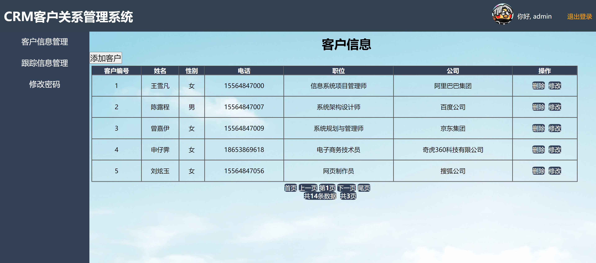

<h1 align="center">客户管理系统</h1>

## 简介
客户管理系统：角色分为管理员、用户；功能包括客户信息管理、跟踪信息管理、密码修改、用户登录注册。    --计算机毕业设计源码；毕设源码；java毕业设计源码

## 联系方式

<h3 align="center">获取完整代码与数据库文件 + 微信：bysj5151 QQ: 86050149 QQ群: 783742310</h3>

<h3 align="center">可帮忙远程部署 包运行成功！提供远程部署、修改代码、设计文档指导、代码讲解等服务！</h3>

## 功能介绍（完整见运行截图）
管理员：具备登录系统、管理客户信息、跟踪信息、以及修改密码的功能。可查看、添加、修改和删除客户及跟踪信息，确保客户数据的准确性及安全性。界面显示当前登录信息，并提供安全注销选项。

客户：通过登录界面（提供注册选项）进入系统，享受简洁直观的用户体验。可以查询个人信息、完善客户资料及查看历史记录，利用密码修改功能保障账户安全。

操作员：在CRM系统中，通过客户信息管理和跟踪信息管理，实现客户关系的维护。可以添加、修改、删除信息，追踪客户动态，提升客户满意度和跟踪效率。

## 运行截图

本代码来源于网络,仅供学习参考使用!

